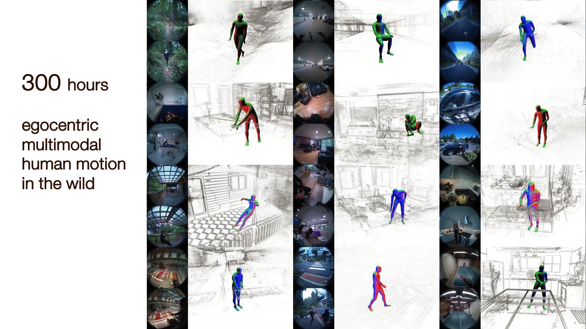
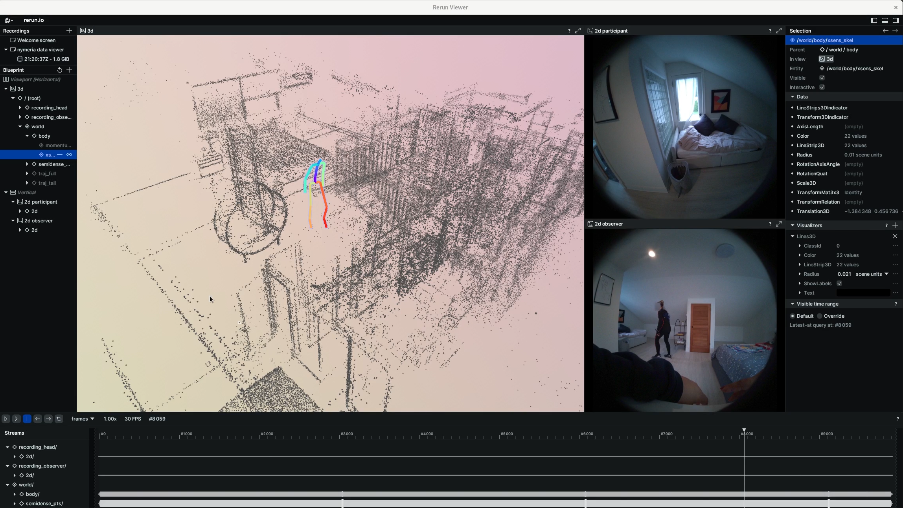
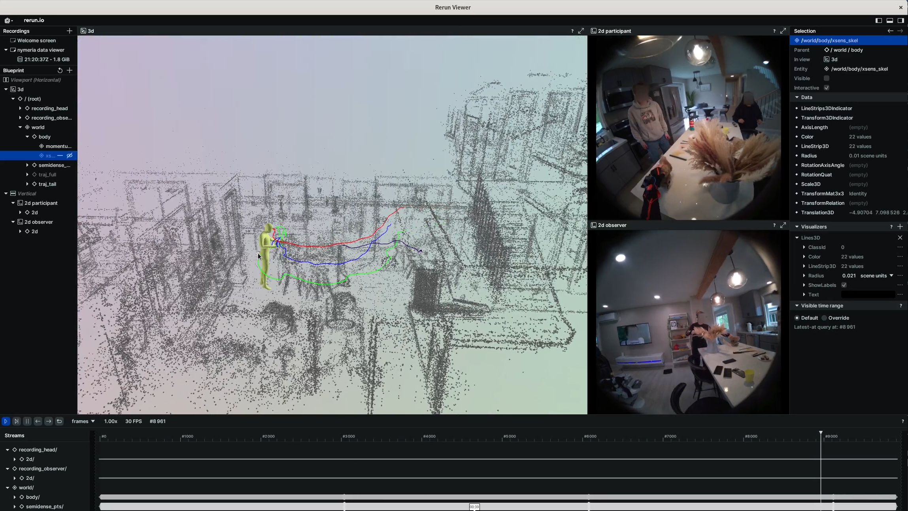

# Nymeria Dataset

[[Project Page]](https://www.projectaria.com/datasets/nymeria/)
[[Data Explorer]](https://explorer.projectaria.com/?v=%22Nymeria%22)
[[Paper]](https://arxiv.org/abs/2406.09905) [[Bibtex]](#attribution)

Nymeria is the world's largest dataset of human motion in the wild, capturing
diverse people performing diverse activities across diverse locations. It is
first of a kind to record body motion using multiple egocentric multimodal
devices, all accurately synchronized and localized in one metric 3D world.
Nymeria is also the world's largest motion dataset with natural language
descriptions. The dataset is designed to accelerate research in egocentric human
motion understanding and presents exciting challenges to advance contextualized
computing and future AR/VR technology. This repository hosts the API for
downloading and visualizing the dataset.

<p align="center">
  
  
</p>

## Getting Started

### Installation

Run the following commands to create a conda environment `pymeria` with this
repository installed by pip.

```
   git clone git@github.com:facebookresearch/nymeria_dataset.git
   cd nymeria_dataset
   conda env create -f environment.yml
```

_Note_. Currently we only support Linux. This is due to how we install
[pymomentum](https://github.com/facebookincubator/momentum). This dependency is
used to load the parametric mesh model for body motion. If your workflow does
not require this modality, removing pymomentum should be sufficient to get the
code running on Windows and MacOS.

### Download dataset

Review the dataset [LICENSE](./LICENSE) to ensure your use case is covered.

**Before you start.** Nymeria has more than 1200 sequences, and each sequence
contains data/annotations recorded by multiple devices. Altogether the dataset
is approximately 70TB. To easy access, the dataset is chunked into sequences and
sequences into data groups. A data group is a fixed collection of files, which
must be downloaded together via a url. The predefined data groups are specified
in
[definition.py](https://github.com/facebookresearch/nymeria_dataset/blob/main/nymeria/definitions.py#L29-L83).
Each sequence is tagged by a list of attributes, as described in
[sequence_attributes.py](https://github.com/facebookresearch/nymeria_dataset/blob/main/nymeria/sequence_attributes.py#L10-L62).
We have built basic support to filter sequences by their attributes. With this
in mind, continue with one of the following paths.

**Option 1 - Download sample files.** Visit
[dataset explorer](https://explorer.projectaria.com/?v=%22Nymeria%22), click any
sequences for detailed view. On the right panel, locate a list of links to
download particular data groups for that sequence.

**Option 2 - Batch download multiple sequences.** For batch download, we provide
a JSON file (`nymeria_download_urls.json`) with urls. There are two ways to
obtain this JSON file. First, you can visit the
[project page](https://www.projectaria.com/datasets/nymeria/), and sign up for
_Access the Dataset_ located at the bottom to be directed to the download. The
downloaded file will contain the urls to the full dataset. Alternatively, you
generate a customized JSON file with only selected sequences and modalities on
[dataset explorer](https://explorer.projectaria.com/nymeria) using the data
filter option. In either way, urls provided by the JSON file is valid for 14
days. Please obtain a new JSON file upon expiration.

With the JSON file, you can visit the urls to download data. For convinience, we
provide [download.py](./download.py) as an example script to parses the JSON
file and download data into formatted directories.

```
conda activate pymeria
cd nymeria_dataset

python download.py -i <Nymeria_download_urls.json> -o <output_path> [-k <partial_key>]
```

By modifying the function
[`get_groups()`](https://github.com/facebookresearch/nymeria_dataset/blob/main/download.py#L9-L29),
you can customize which data groups will be downloaded. The script will produce
a `download_summary.json` under the `<output_path>`. The optional argument `-k`
implements a partial key matching to select desired sequences. Nymeria sequences
are named by the following convention
`<date>_<session_id>_<fake_id>_<act_id>_<uid>`. Here are some examples for how
to use the sequence filter.

```
# E.g., get all sequences collected in June
python download.py -i <Nymeria_download_urls.json> -o <output_path> -k 202306

# E.g., get all sequences from participant with fake_name, 'james_johnson'
python download.py -i <Nymeria_download_urls.json> -o <output_path> -k james_johnson

# E.g., get a particular sequence with uid egucf6
python download.py -i <Nymeria_download_urls.json> -o <output_path> -k egucf6
```

### Load Nymeria data with visualization

To load Nymeria sequences, please refer to the implementation of
[`NymeriaDataProvider`](https://github.com/facebookresearch/nymeria_dataset/blob/main/nymeria/data_provider.py#L25).
This class expects formatted sequence directory as downloaded by previous
section. It can be configured to load different modalities. Currently, this
class implements the following functions

- Loading Vrs recordings and their MPS location output
- Loading body motion as XSens kinematic skeleton and Momentum parametric mesh
  model
- Synchronize data from multiple sources
- Compute alignment to register body motion into the same world coordinates of
  Aria devices

To visualize a sequence, run the viewer as

```
python viewer.py -i <nymeria_sequence_path> [-s]
```

<p align="center">
  
  
</p>

## License

Nymeria dataset and code is released by Meta under the Creative Commons
Attribution-NonCommercial 4.0 International License
([CC BY-NC 4.0](https://creativecommons.org/licenses/by-nc/4.0/legalcode)). Data
and code may not be used for commercial purposes. For more information, please
refer to the [LICENSE](./LICENSE) file included in this repository.

### Attribution

When using the dataset and code, please attribute it as follows:

```
@inproceedings{ma24eccv,
      title={Nymeria: A Massive Collection of Multimodal Egocentric Daily Motion in the Wild},
      author={Lingni Ma and Yuting Ye and Fangzhou Hong and Vladimir Guzov and Yifeng Jiang and Rowan Postyeni and Luis Pesqueira and Alexander Gamino and Vijay Baiyya and Hyo Jin Kim and Kevin Bailey and David Soriano Fosas and C. Karen Liu and Ziwei Liu and Jakob Engel and Renzo De Nardi and Richard Newcombe},
      booktitle={the 18th European Conference on Computer Vision (ECCV)},
      year={2024},
      url={https://arxiv.org/abs/2406.09905},
}
```

### Contribute

We welcome contributions! Go to [CONTRIBUTING](.github/CONTRIBUTING.md) and our
[CODE OF CONDUCT](.github/CODE_OF_CONDUCT.md) for how to contribute.
